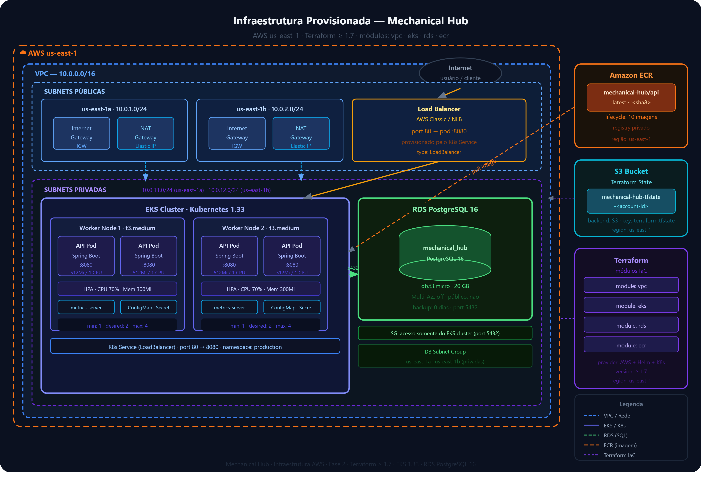
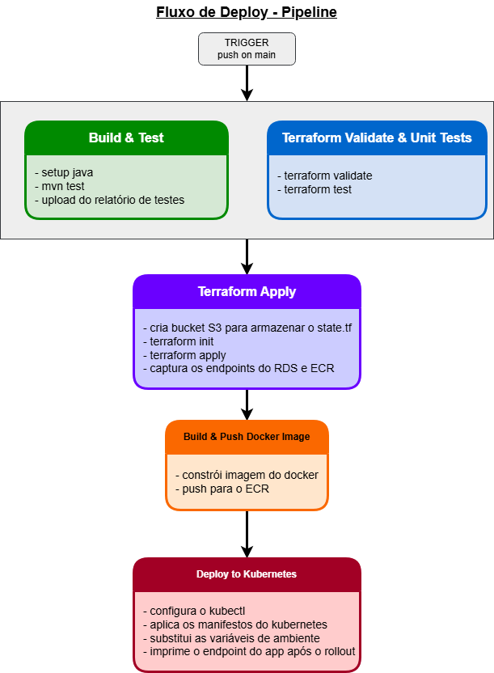

# 🏗️ Arquitetura — Mechanical Hub

Este documento detalha a arquitetura da aplicação, a infraestrutura provisionada na AWS e o fluxo de deploy automatizado via CI/CD.

---

## Componentes da Aplicação

A aplicação segue Clean Architecture em camadas, com separação clara entre domínio, casos de uso e adaptadores:

```
mechanical-hub/
├── src/main/java/
│   └── com.fiap.mechanical_hub/
│       ├── domain/          # Entidades e interfaces de repositório
│       ├── application/     # Casos de uso (serviços de negócio)
│       ├── infrastructure/  # Implementações JPA, adapters externos
│       └── interfaces/      # Controllers REST, DTOs
├── src/main/resources/
│   ├── db/migration/        # Migrations Flyway (esquema + seeds)
│   ├── k8s/                 # Manifests Kubernetes
│   └── application.yml
├── ci/remote-state/         # Terraform somente leitura dos states de infra/database
├── Dockerfile               # Build multi-stage (Maven → JRE 21)
└── docker-compose.yml       # Stack local (app + postgres + sonarqube)
```

**Diagrama de componentes:**

```
┌──────────────────────────────────────────────────────────┐
│                    Mechanical Hub API                    │
│                                                          │
│  ┌─────────────┐   ┌──────────────┐   ┌──────────────┐  │
│  │  REST Layer │──▶│  Use Cases   │──▶│   Domain     │  │
│  │ (Controllers│   │ (Application)│   │  (Entities)  │  │
│  │  + Swagger) │   └──────┬───────┘   └──────────────┘  │
│  └─────────────┘          │                              │
│                     ┌─────▼───────┐                      │
│                     │   JPA /     │                      │
│                     │  Flyway     │                      │
│                     └─────┬───────┘                      │
└───────────────────────────┼──────────────────────────────┘
                            │
                    ┌───────▼────────┐
                    │  PostgreSQL 16 │
                    │  (RDS / local) │
                    └────────────────┘
```

**Recursos Kubernetes provisionados:**

| Recurso | Detalhes |
|---|---|
| `Namespace` | `production` |
| `Deployment` | 2 réplicas, RollingUpdate (`maxSurge: 1`, `maxUnavailable: 0`) |
| `Service` | `NodePort` fixo (30080) → pod 8080; sem IP público (item 47 do plano) |
| `HPA` | min 2 / max 4 réplicas; escala por CPU (70%) e memória (300 Mi) |
| `ConfigMap` | Variáveis de ambiente não-sensíveis (host do banco, porta, perfil) |
| `Secret` | `DB_PASSWORD` e `JWT_SECRET` |

---

## Infraestrutura Consumida

A partir da Fase 3 este repositório **não provisiona infraestrutura** (ADR-0002).
Os módulos Terraform que viviam em `infra/` foram migrados para repositórios
próprios, cada um com seu state e seu pipeline:

| Módulo | Repositório de destino |
|---|---|
| `vpc`, `eks`, `ecr` | [`mechanical-hub-infra`](https://github.com/) |
| `rds` | [`mechanical-hub-database`](https://github.com/) |

O que resta aqui é a leitura desses states, em `ci/remote-state/`:

```
ci/remote-state/
├── main.tf     # Dois data "terraform_remote_state" (infra e database) + outputs
└── README.md   # Contrato: quem produz e quem consome cada output
```

**Contrato consumido pelo pipeline:**

| Output | Origem | Uso |
|---|---|---|
| `eks_cluster_name` | `mechanical-hub-infra` | `aws eks update-kubeconfig --name` |
| `ecr_repository_url` | `mechanical-hub-infra` | destino do `docker push` e imagem do Deployment |
| `rds_endpoint` | `mechanical-hub-database` | `DB_HOST` |
| `rds_port` | `mechanical-hub-database` | `DB_PORT` |
| `rds_db_name` | `mechanical-hub-database` | `DB_NAME` |

Ordem de provisionamento: `infra → database → auth → aplicação`. Um push nesta
aplicação nunca altera VPC, EKS, ECR ou RDS.

**Como a aplicação é alcançada de fora da VPC.** O Service não tem IP público
(item 47 do plano — ver tabela de recursos K8s acima). O `mechanical-hub-infra`
provisiona um NLB interno apontando para o NodePort fixo deste repositório
(`app_node_port`, hoje 30080); o `mechanical-hub-auth` cria um VPC Link do API
Gateway até esse NLB. A cadeia completa é
`cliente → API Gateway → VPC Link → NLB interno → NodePort → pod`.

**Diagrama de infraestrutura (AWS):**


---

## Fluxo de Deploy

O pipeline CI/CD é executado pelo GitHub Actions em cada push para a branch `main`. Os jobs são executados em sequência com dependências explícitas:



```
push → main
       │
       ├─ Job 1: Build & Test (Java/Maven)
       │          • mvn test
       │          • Salva resultados dos testes no GitHub Actions (7 dias)
       │
       ├─ Job 2: Resolve Infrastructure Outputs  ← depende de [1]
       │          • ci/remote-state: leitura dos states remotos
       │          • De mechanical-hub-infra: eks_cluster_name, ecr_repository_url
       │          • De mechanical-hub-database: rds_endpoint, rds_port, rds_db_name
       │          • Nenhum recurso é criado ou alterado
       │
       ├─ Job 3: Build & Push Docker Image  ← depende de [2]
       │          • docker buildx (multi-stage Dockerfile)
       │          • Push para ${ecr_repository_url}: :<sha8> + :latest
       │
       └─ Job 4: Deploy to Kubernetes  ← depende de [2, 3]
                  • aws eks update-kubeconfig --name ${eks_cluster_name}
                  • envsubst nos manifests k8s/
                  • kubectl apply (namespace → secret → configmap
                    → deployment → service → hpa)
                  • kubectl rollout status --timeout=600s
```

> Pull Requests executam apenas o Job 1. Os demais são condicionados a
> `push` em `main` — nenhum PR toca a AWS.

---

← [Voltar ao README](../README.md)
