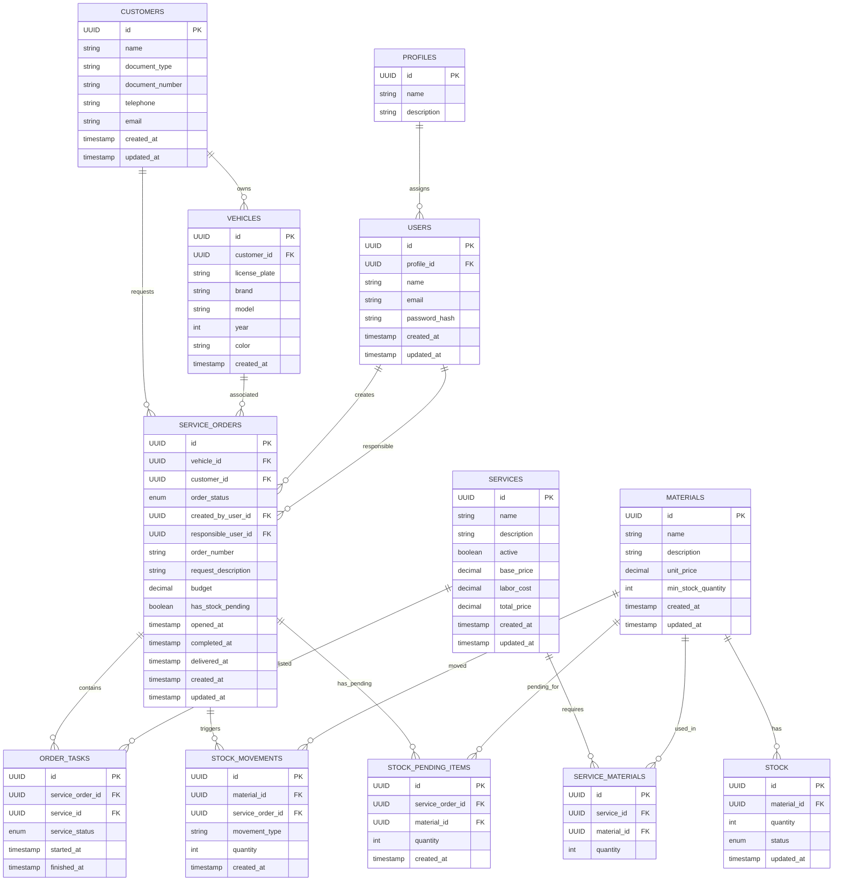

# Modelagem de Dados – mechanical-hub MVP

## Diagrama ER

---

## Descrição das Tabelas

### CUSTOMERS
Armazena os dados cadastrais dos clientes da oficina.

| Coluna | Tipo | Restrições | Descrição |
|---|---|---|---|
| `id` | UUID | PK | Identificador único |
| `name` | string | NOT NULL | Nome completo do cliente |
| `document_type` | string | NOT NULL | Tipo do documento: `CPF` ou `CNPJ` |
| `document_number` | string | NOT NULL, UNIQUE | Número do documento validado |
| `telephone` | string | NOT NULL | Telefone de contato |
| `email` | string | NOT NULL | E-mail do cliente |
| `created_at` | timestamp | NOT NULL | Data de criação |
| `updated_at` | timestamp | NOT NULL | Data da última atualização |

---

### CUSTOMER_ADDRESSES
Armazena os endereços vinculados a cada cliente. Um cliente pode ter múltiplos endereços.

| Coluna | Tipo | Restrições | Descrição |
|---|---|---|---|
| `id` | UUID | PK | Identificador único |
| `customer_id` | UUID | FK → CUSTOMERS | Cliente dono do endereço |
| `street` | string | NOT NULL | Logradouro |
| `number` | string | NOT NULL | Número |
| `complement` | string | nullable | Complemento |
| `neighborhood` | string | NOT NULL | Bairro |
| `city` | string | NOT NULL | Cidade |
| `state` | string | NOT NULL | Estado (UF) |
| `zip_code` | string | NOT NULL | CEP |
| `created_at` | timestamp | NOT NULL | Data de criação |

---

### VEHICLES
Armazena os veículos cadastrados, cada um vinculado a um cliente.

| Coluna | Tipo | Restrições | Descrição |
|---|---|---|---|
| `id` | UUID | PK | Identificador único |
| `customer_id` | UUID | FK → CUSTOMERS | Proprietário do veículo |
| `license_plate` | string | NOT NULL, UNIQUE | Placa do veículo (padrão antigo ou Mercosul) |
| `brand` | string | NOT NULL | Marca |
| `model` | string | NOT NULL | Modelo |
| `year` | int | NOT NULL | Ano de fabricação |
| `color` | string | NOT NULL | Cor |
| `created_at` | timestamp | NOT NULL | Data de criação |
| `updated_at` | timestamp | NOT NULL | Data da última atualização |

---

### USERS
Usuários do sistema com acesso à plataforma.

| Coluna | Tipo | Restrições | Descrição |
|---|---|---|---|
| `id` | UUID | PK | Identificador único |
| `profile_id` | UUID | FK → PROFILES | Perfil de acesso do usuário |
| `name` | string | NOT NULL | Nome do usuário |
| `email` | string | NOT NULL, UNIQUE | E-mail de login |
| `password_hash` | string | NOT NULL | Senha criptografada |
| `created_at` | timestamp | NOT NULL | Data de criação |
| `updated_at` | timestamp | NOT NULL | Data da última atualização |

---

### PROFILES
Define os perfis de acesso disponíveis no sistema. Populado via seed.

| Coluna | Tipo | Restrições | Descrição |
|---|---|---|---|
| `id` | UUID | PK | Identificador único |
| `name` | string | NOT NULL, UNIQUE | Nome do perfil: `Mecânico` ou `Administrador` |
| `description` | string | nullable | Descrição das responsabilidades do perfil |

---

### ORDER_STATUS
Enum de status possíveis para uma Ordem de Serviço. Populado via seed.

| Coluna | Tipo | Restrições | Descrição |
|---|---|---|---|
| `id` | UUID | PK | Identificador único |
| `status` | string | NOT NULL, UNIQUE | Nome do status |
| `description` | string | nullable | Descrição do status |

**Valores do seed:**

| Status | Descrição |
|---|---|
| `Recebida` | Ordem recém criada |
| `Em diagnóstico` | Mecânico iniciou avaliação |
| `Aguardando aprovação` | Orçamento enviado ao cliente |
| `Aprovado` | Cliente aprovou a OS |
| `Recusada` | Cliente recusou a OS |
| `Em execução` | Mecânico iniciou execução |
| `Finalizada` | Todos os serviços concluídos |
| `Entregue` | Veículo entregue ao cliente |

---

### SERVICE_STATUS
Enum de status dos serviços dentro de uma Ordem de Serviço. Populado via seed.

| Coluna | Tipo | Restrições | Descrição |
|---|---|---|---|
| `id` | UUID | PK | Identificador único |
| `status` | string | NOT NULL, UNIQUE | Nome do status |
| `description` | string | nullable | Descrição do status |

**Valores do seed:**

| Status | Descrição |
|---|---|
| `Não iniciado` | Padrão ao vincular o serviço à OS |
| `Iniciado` | Mecânico começou a executar |
| `Finalizado` | Serviço concluído |

---

### SERVICE_ORDERS
Ordens de serviço abertas para um veículo de um cliente.

| Coluna | Tipo | Restrições | Descrição |
|---|---|---|---|
| `id` | UUID | PK | Identificador único |
| `vehicle_id` | UUID | FK → VEHICLES | Veículo da OS |
| `customer_id` | UUID | FK → CUSTOMERS | Cliente da OS |
| `order_status_id` | UUID | FK → ORDER_STATUS | Status atual da OS |
| `created_by_user_id` | UUID | FK → USERS | Usuário que criou a OS |
| `responsible_user_id` | UUID | FK → USERS, nullable | Mecânico responsável |
| `order_number` | string | NOT NULL, UNIQUE | Identificador legível, formato `OS-YYYYMM-NNNN` |
| `request_description` | string | NOT NULL, max 255 | Descrição do pedido do cliente |
| `budget` | decimal | nullable | Orçamento calculado automaticamente |
| `has_stock_pending` | boolean | NOT NULL, default `false` | Indica pendência de itens em estoque |
| `estimated_completion_at` | timestamp | nullable | Estimativa de conclusão |
| `opened_at` | timestamp | nullable | Data em que o diagnóstico foi iniciado |
| `completed_at` | timestamp | nullable | Data de finalização |
| `delivered_at` | timestamp | nullable | Data de entrega ao cliente |
| `created_at` | timestamp | NOT NULL | Data de criação |
| `updated_at` | timestamp | NOT NULL | Data da última atualização |

---

### SERVICES
Catálogo de serviços pré-cadastrados disponíveis para incluir em ordens.

| Coluna | Tipo | Restrições | Descrição |
|---|---|---|---|
| `id` | UUID | PK | Identificador único |
| `name` | string | NOT NULL | Nome do serviço |
| `description` | string | nullable | Descrição detalhada |
| `active` | boolean | NOT NULL, default `true` | Indica se o serviço está disponível |
| `base_price` | decimal | NOT NULL | Preço base do serviço |
| `labor_cost` | decimal | NOT NULL | Custo de mão de obra |
| `total_price` | decimal | NOT NULL | Calculado: `labor_cost + Σ unit_price dos materiais` |
| `created_at` | timestamp | NOT NULL | Data de criação |
| `updated_at` | timestamp | NOT NULL | Data da última atualização |

---

### ORDER_SERVICES
Tabela de relacionamento entre Ordens de Serviço e Serviços, com controle de status e tempo de execução.

| Coluna | Tipo | Restrições | Descrição |
|---|---|---|---|
| `id` | UUID | PK | Identificador único |
| `service_order_id` | UUID | FK → SERVICE_ORDERS | OS à qual o serviço pertence |
| `service_id` | UUID | FK → SERVICES | Serviço vinculado |
| `service_status_id` | UUID | FK → SERVICE_STATUS | Status atual do serviço na OS |
| `started_at` | timestamp | nullable | Data de início da execução |
| `finished_at` | timestamp | nullable | Data de conclusão |

---

### SERVICE_MATERIALS
Define quais materiais (e em quais quantidades) são necessários para executar cada serviço.

| Coluna | Tipo | Restrições | Descrição |
|---|---|---|---|
| `id` | UUID | PK | Identificador único |
| `service_id` | UUID | FK → SERVICES | Serviço que utiliza o material |
| `material_id` | UUID | FK → MATERIALS | Material necessário |
| `quantity` | int | NOT NULL | Quantidade necessária por execução do serviço |

---

### MATERIALS
Cadastro de peças e insumos utilizados nos serviços da oficina.

| Coluna | Tipo | Restrições | Descrição |
|---|---|---|---|
| `id` | UUID | PK | Identificador único |
| `name` | string | NOT NULL | Nome da peça ou insumo |
| `description` | string | nullable | Descrição detalhada |
| `unit_price` | decimal | NOT NULL | Preço unitário |
| `min_stock_quantity` | int | NOT NULL | Quantidade mínima aceitável em estoque |
| `created_at` | timestamp | NOT NULL | Data de criação |
| `updated_at` | timestamp | NOT NULL | Data da última atualização |

> Ao cadastrar um material, um registro inicial deve ser criado em `STOCK` com `quantity = 0` e `status = 'disponivel'`.

---

### STOCK
Controla a quantidade atual de cada material no estoque, com distinção entre itens disponíveis e reservados para ordens.

| Coluna | Tipo | Restrições | Descrição |
|---|---|---|---|
| `id` | UUID | PK | Identificador único |
| `material_id` | UUID | FK → MATERIALS | Material controlado |
| `quantity` | int | NOT NULL | Quantidade atual no estoque |
| `status` | enum | NOT NULL, default `disponivel` | Estado do item: `disponivel` ou `reservado` |
| `updated_at` | timestamp | NOT NULL | Data da última atualização |

**Valores do enum `status`:**

| Valor | Descrição |
|---|---|
| `disponivel` | Item está em estoque e pode ser utilizado em novas ordens |
| `reservado` | Item está em estoque, porém já foi alocado para uma ordem de serviço específica |

**Regras de transição de status:**

| Evento | Transição |
|---|---|
| Cadastro do material | Criado com `disponivel` |
| Entrada de novos itens no estoque | Criado/incrementado com `disponivel` |
| Serviço adicionado à OS com estoque suficiente | `disponivel` → `reservado` |
| OS recusada | `reservado` → `disponivel` |

---

### STOCK_MOVEMENTS
Histórico de todas as movimentações de estoque, sejam entradas, reservas ou retornos.

| Coluna | Tipo | Restrições | Descrição |
|---|---|---|---|
| `id` | UUID | PK | Identificador único |
| `material_id` | UUID | FK → MATERIALS | Material movimentado |
| `service_order_id` | UUID | FK → SERVICE_ORDERS, nullable | OS relacionada (quando aplicável) |
| `movement_type` | string | NOT NULL | Tipo: `entrada`, `reserva` ou `retorno` |
| `quantity` | int | NOT NULL | Quantidade movimentada |
| `created_at` | timestamp | NOT NULL | Data da movimentação |

**Valores de `movement_type`:**

| Valor | Quando ocorre |
|---|---|
| `entrada` | Administrador registra novos itens no estoque |
| `reserva` | Item é alocado para uma OS ao adicionar serviços |
| `retorno` | Item é devolvido ao estoque quando a OS é recusada |

---

### STOCK_PENDING_ITEMS *(nova tabela)*
Registra individualmente cada item em falta por Ordem de Serviço. Utilizada para rastrear e resolver pendências de estoque de forma ordenada, priorizando as pendências mais antigas.

| Coluna             | Tipo | Restrições | Descrição                                              |
|--------------------|---|---|--------------------------------------------------------|
| `id`               | UUID | PK | Identificador único                                    |
| `service_order_id` | UUID | FK → SERVICE_ORDERS | OS que possui a pendência                              |
| `material_id`      | UUID | FK → MATERIALS | Material em falta no estoque                           |
| `quantity`         | int | NOT NULL | Quantidade pendente do material                        |
| `created_at`       | timestamp | NOT NULL | Data de criação do registro (usada para ordenar prioridade) |

**Regras:**

- Um registro é criado para **cada item em falta** ao adicionar serviços em uma OS.
- Registros são **excluídos** automaticamente quando a pendência é resolvida (item reposto no estoque e deduzido para a OS).
- A ordenação por `created_at ASC` garante que ordens com pendências mais antigas sejam resolvidas primeiro.
- Quando **não existir nenhum registro** desta tabela vinculado a uma OS, a flag `has_stock_pending` da OS deve ser atualizada para `false`.

**Eventos que acionam a resolução de pendências:**

| Evento | Descrição |
|---|---|
| Entrada de estoque | Ao inserir itens, verificar e resolver pendências do material inserido |
| Retorno por recusa de OS | Ao devolver itens de uma OS recusada, verificar e resolver pendências dos materiais retornados |

---